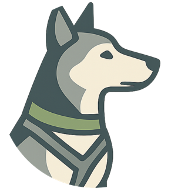

# 🐾 PfotenRegister – Die Verwaltungssoftware für Tiertafeln

**PfotenRegister** ist eine moderne, browserbasierte Verwaltungsplattform für Tiertafeln. Sie wurde speziell für ehrenamtliche Helfer:innen entwickelt, um bedürftige Tierhalter:innen effizient, sicher und benutzerfreundlich zu betreuen.

[Website](https://pfotenregister.com)
---

##  Funktionsübersicht

- **Gastverwaltung**: Registrierung, Bearbeitung, Ansichtt von Gästen inkl. rechtlicher Vertreter.
- **Gastkartensystem mit QR-Code Scanner**: Optional, nutze einen QR-Code Scanner, um Gäste einfacher zu empfangen.
- **Tierverwaltung**: Verwaltung von mehreren Tieren pro Haushalt mit Futterplänen, Gesundheitsdaten und Notizen.
- **Futterausgabe**: Einfache Dokumentation von Ausgabeterminen mit Kommentaren und Warnhinweisen bei zu früher Abholung.
- **Änderungsprotokoll**: Automatisiertes Log von Änderungen an Gast- und Tierdaten.
- **Benutzerverwaltung**: Rollenbasierte Benutzerverwaltung (Admin, Bearbeiter, Nutzer).
- **Druckbare Gästekarten**: QR-Codes und Gastnummern zur einfachen Identifikation bei der Ausgabe.
- **Anpassbar**: Anpassbare Parameter wie Logo, Farben, Name der Tiertafel, Maximalanzahl Tiere u.v.m.
- **Kassensystem für Zahlungen**: Übersichtliche Zahlungshistorien für Futter oder Zubehör.

---

##  Demo

Eine Demo zum ausprobieren der Funktionen kann unter der folgenden URL gefunden werden. 
Bitte gebe keine Personenbezogenen Daten ein. Die Datenbank wird periodisch zurückgesetzt.
Logins sind: 

| Benutzername | Passwort | Berechtigungen                                                     |
|--------------|----------|--------------------------------------------------------------------|
| admin        | admin    | Administor: Benutzerverwaltung, Gastverwaltung, Ansicht von Gästen |
| editor       | editor   | Bearbeiter: Wie Admins außer Benutzerverwaltung                    |
| user         | user     | Benutzer: Nur Ansicht von Gästen                                   |

### [PfotenRegister Demo](https://demo.pfotenregister.com)

---

## Funktionen
### Gastverwaltung


## Lokale Einrichtung

Die Anwendung läuft lokal mit Python. Eine passende MariaDB kann optional als
separater Docker-Container gestartet werden. Dadurch bleibt die lokale
Datenbank von installierten MariaDB-Versionen und produktiven Datenbanken
getrennt.

<details>
<summary><strong>Windows 10/11: vollständige Installation</strong></summary>

Die folgenden Befehle werden in **PowerShell** ausgeführt. Für die Installation
von WSL muss PowerShell einmalig als Administrator gestartet werden.

#### 1. WSL 2 und Docker Desktop installieren

Docker Desktop verwendet unter Windows standardmäßig WSL 2. Prüfe zuerst den
Status:

```powershell
wsl --status
```

Falls WSL noch nicht installiert ist, führe diesen Befehl als Administrator
aus und starte Windows anschließend neu:

```powershell
wsl --install
```

Installiere danach
[Docker Desktop für Windows](https://docs.docker.com/desktop/setup/install/windows-install/),
wähle während der Installation das WSL-2-Backend und starte Docker Desktop.
Weitere Hinweise zur WSL-Installation stehen in der
[Microsoft-Anleitung](https://learn.microsoft.com/en-us/windows/wsl/install).

Prüfe in einem neuen PowerShell-Fenster, ob Docker läuft:

```powershell
docker version
docker compose version
```

#### 2. uv und Python installieren

Installiere `uv` mit dem offiziellen Windows-Installer:

```powershell
powershell -ExecutionPolicy ByPass -c "irm https://astral.sh/uv/install.ps1 | iex"
```

Schließe PowerShell, öffne ein neues Fenster und prüfe die Installation:

```powershell
uv --version
```

`uv` kann Python selbst verwalten; ein separater Python-Installer ist deshalb
nicht erforderlich. Installiere die im Projekt festgelegte Python-Version:

```powershell
uv python install 3.8
uv python find 3.8
```

Alternativ sind die aktuellen Installationsmöglichkeiten in der
[uv-Dokumentation](https://docs.astral.sh/uv/getting-started/installation/)
beschrieben.

#### 3. PfotenRegister einrichten

Wechsle in den entpackten oder geklonten Projektordner. Ersetze den Beispielpfad
durch den tatsächlichen Speicherort:

```powershell
Set-Location "C:\Pfad\zu\PfotenRegister"
uv sync --extra test
Copy-Item config_local.env.example config_local.env
notepad config_local.env
```

Erzeuge einen zufälligen Anwendungsschlüssel und kopiere die Ausgabe als
`SECRET_KEY` nach `config_local.env`:

```powershell
uv run python -c "import secrets; print(secrets.token_hex(32))"
```

Für eine rein lokale Installation bleiben diese Einstellungen erhalten:

```env
STORAGE_BACKEND=local
LOCAL_STORAGE_PATH=var/uploads
```

#### 4. MariaDB starten und Anwendung initialisieren

```powershell
docker compose up -d --wait db
docker compose ps
uv run dotenv -f config_local.env run -- flask --app run create-admin
uv run dotenv -f config_local.env run -- alembic stamp head
```

Der Befehl `create-admin` fragt Benutzername, Passwort und Anzeigename ab. Das
Stamping ist nur bei einer komplett neuen Datenbank erforderlich, nicht nach
der Wiederherstellung eines vorhandenen Backups.

#### 5. PfotenRegister starten

```powershell
uv run dotenv -f config_local.env run -- python run.py
```

Öffne anschließend
[http://127.0.0.1:5000](http://127.0.0.1:5000) im Browser. Zum späteren Start
genügen Docker Desktop und diese Befehle:

```powershell
docker compose up -d --wait db
uv run dotenv -f config_local.env run -- python run.py
```

</details>

<details>
<summary><strong>macOS: vollständige Installation</strong></summary>

Die folgenden Befehle werden im **Terminal** ausgeführt.

#### 1. Docker Desktop installieren

Lade [Docker Desktop für macOS](https://docs.docker.com/desktop/setup/install/mac-install/)
für den passenden Prozessor herunter: Apple Silicon oder Intel. Öffne
`Docker.dmg`, ziehe Docker nach `Programme` und starte Docker Desktop.

Prüfe in einem neuen Terminalfenster, ob Docker läuft:

```bash
docker version
docker compose version
```

#### 2. uv und Python installieren

Installiere `uv` mit dem offiziellen macOS-Installer:

```bash
curl -LsSf https://astral.sh/uv/install.sh | sh
```

Schließe das Terminal, öffne ein neues Fenster und prüfe die Installation:

```bash
uv --version
```

`uv` installiert und verwaltet die benötigte Python-Version, daher ist kein
separater Python-Installer erforderlich:

```bash
uv python install 3.8
uv python find 3.8
```

Weitere Installationsvarianten stehen in der
[uv-Dokumentation](https://docs.astral.sh/uv/getting-started/installation/).

#### 3. PfotenRegister einrichten

Wechsle in den entpackten oder geklonten Projektordner. Ersetze den Beispielpfad
durch den tatsächlichen Speicherort:

```bash
cd /Pfad/zu/PfotenRegister
uv sync --extra test
cp config_local.env.example config_local.env
nano config_local.env
```

Erzeuge einen zufälligen Anwendungsschlüssel und kopiere die Ausgabe als
`SECRET_KEY` nach `config_local.env`:

```bash
uv run python -c "import secrets; print(secrets.token_hex(32))"
```

Für eine rein lokale Installation bleiben diese Einstellungen erhalten:

```env
STORAGE_BACKEND=local
LOCAL_STORAGE_PATH=var/uploads
```

#### 4. MariaDB starten und Anwendung initialisieren

```bash
docker compose up -d --wait db
docker compose ps
uv run dotenv -f config_local.env run -- flask --app run create-admin
uv run dotenv -f config_local.env run -- alembic stamp head
```

Der Befehl `create-admin` fragt Benutzername, Passwort und Anzeigename ab. Das
Stamping ist nur bei einer komplett neuen Datenbank erforderlich, nicht nach
der Wiederherstellung eines vorhandenen Backups.

#### 5. PfotenRegister starten

```bash
uv run dotenv -f config_local.env run -- python run.py
```

Öffne anschließend
[http://127.0.0.1:5000](http://127.0.0.1:5000) im Browser. Zum späteren Start
genügen Docker Desktop und diese Befehle:

```bash
docker compose up -d --wait db
uv run dotenv -f config_local.env run -- python run.py
```

</details>

### Voraussetzungen

- [uv](https://docs.astral.sh/uv/getting-started/installation/) oder Python 3.8+
- Docker mit Docker Compose, falls die mitgelieferte MariaDB verwendet wird
- Optional: ein Entwicklungs-Bucket in Google Cloud Storage

Die folgenden Abschnitte sind die kompakte Referenz für bereits eingerichtete
Entwicklungsumgebungen.

### 1. Python-Abhängigkeiten installieren

Alle folgenden Befehle werden im Ordner `PfotenRegister` ausgeführt:

```bash
uv sync --extra test
```

Alternativ mit `pip`:

```bash
python -m venv .venv
source .venv/bin/activate
pip install -r requirements.txt -r requirements-test.txt
```

### 2. Lokale Konfiguration anlegen

```bash
cp config_local.env.example config_local.env
```

Passe mindestens `SECRET_KEY` an. Standardmäßig werden Anhänge unter
`var/uploads` auf dem lokalen Dateisystem gespeichert. Der Ordner wird von Git
ignoriert und sollte zusammen mit der Datenbank gesichert werden.

Alternativ kann weiterhin Google Cloud Storage verwendet werden. Setze dafür
`STORAGE_BACKEND=gcs`, trage `GCS_BUCKET_NAME` ein und konfiguriere die
Google-Zugangsdaten. Für lokale Application Default Credentials kann statt
einer Service-Account-Datei folgender Befehl verwendet werden:

```bash
gcloud auth application-default login
```

Ein eigener Dateisystem-Container ist für die lokale Entwicklung nicht nötig:
Er würde denselben Ordner lediglich mit zusätzlichen beweglichen Teilen
bereitstellen. Läuft die Anwendung selbst in Docker, sollte `var/uploads` als
persistentes Volume eingebunden werden. Für mehrere App-Instanzen oder
produktionsähnliche Object-Storage-Tests ist GCS beziehungsweise ein
S3-kompatibler Dienst wie MinIO die passendere Lösung.

### 3. Optionale MariaDB starten

```bash
docker compose up -d --wait db
docker compose ps
```

Die Datenbank ist anschließend nur lokal unter `127.0.0.1:3306` erreichbar.
Ihre Daten bleiben im Docker-Volume `mariadb_data` erhalten. Wer bereits eine
MariaDB/MySQL-Datenbank verwendet, überspringt diesen Schritt und passt die
`DB_*`-Werte in `config_local.env` an.

### 4. Anwendung initialisieren und starten

Beim ersten Start legt PfotenRegister die fehlenden Tabellen an:

```bash
uv run dotenv -f config_local.env run -- python run.py
```

Markiere eine soeben neu erzeugte Datenbank in einem zweiten Terminal einmalig
mit dem aktuellen Migrationsstand. Bei einer aus einem Backup
wiederhergestellten Datenbank ist dieser Schritt nicht erforderlich:

```bash
uv run dotenv -f config_local.env run -- alembic stamp head
```

Lege anschließend den ersten Administrator an:

```bash
uv run dotenv -f config_local.env run -- flask --app run create-admin
```

Danach ist die Anwendung unter
[http://127.0.0.1:5000](http://127.0.0.1:5000) erreichbar.

### Datenbankmigrationen

Bei einem bestehenden Datenbestand sollten vor dem Start neue Migrationen
eingespielt werden. Alembic verwendet dabei dieselben `DB_*`-Werte wie die
Anwendung:

```bash
uv run dotenv -f config_local.env run -- alembic current
uv run dotenv -f config_local.env run -- alembic upgrade head
```

Vor jeder Migration empfiehlt sich ein Backup. Datenbanken sind bekanntlich
ausgesprochen nachtragend, wenn man diesen langweiligen Schritt überspringt.

### MariaDB sichern und wiederherstellen

Backup-Verzeichnis anlegen und vollständiges SQL-Backup schreiben:

```bash
mkdir -p backups
docker compose exec -T db sh -c 'mariadb-dump --user="$MARIADB_USER" --password="$MARIADB_PASSWORD" --single-transaction --routines --triggers "$MARIADB_DATABASE"' > backups/pfotenregister.sql
```

Backup in die vorhandene lokale Datenbank einspielen:

```bash
docker compose exec -T db sh -c 'mariadb --user="$MARIADB_USER" --password="$MARIADB_PASSWORD" "$MARIADB_DATABASE"' < backups/pfotenregister.sql
```

Bei `STORAGE_BACKEND=local` müssen die Anhänge separat gesichert werden:

```bash
tar -czf backups/pfotenregister-files.tar.gz var/uploads
```

Wiederherstellung im Projektordner:

```bash
tar -xzf backups/pfotenregister-files.tar.gz
```

Datenbank und Dateien sollten im selben Wartungsfenster gesichert werden,
damit Dateiverweise und gespeicherte Anhänge zusammenpassen.

Soll der vorhandene lokale Datenbestand vorher vollständig ersetzt werden,
wird die Datenbank zunächst neu angelegt. **Dieser Befehl löscht alle lokalen
Daten in `pfotenregister`:**

```bash
docker compose exec -T db sh -c 'mariadb --user=root --password="$MARIADB_ROOT_PASSWORD" -e "DROP DATABASE IF EXISTS pfotenregister; CREATE DATABASE pfotenregister CHARACTER SET utf8mb4 COLLATE utf8mb4_unicode_ci;"'
docker compose exec -T db sh -c 'mariadb --user="$MARIADB_USER" --password="$MARIADB_PASSWORD" "$MARIADB_DATABASE"' < backups/pfotenregister.sql
```

Container stoppen oder samt lokalem Daten-Volume entfernen:

```bash
docker compose stop db
docker compose down --volumes
```

`docker compose down --volumes` löscht die lokale Datenbank endgültig. Ein
Backup vorher wäre also eine charmante Idee.

## Testing
See `TESTING.md` for setup and guidelines.

## FAQ

Wie viele Tiere pro Gast?  
Standardmäßig 2 – anpassbar über die Einstellungen.

Kann ich das Logo meiner Tiertafel hochladen?  
Ja! Einfach als URL in den Einstellungen eintragen oder vor Bereitstellung im static-Ordner ablegen.

Funktioniert es auch offline?  
Ja, über die Konsole. Natürlich weniger Nutzerfreundlich – Hosting über Cloud oder lokalen Server empfohlen.

Ist die Software DSGVO-konform?  
Ja, das System speichert nur notwendige personenbezogene Daten. In deiner Datenschutzvereinbarung sollte aber individuell ein Absatz zur Nutzung von Software zur Verarbeitung erstellt werden. Der Anwender ist für die DSGVO-konforme Nutzung verantwortlich.

## Lizenz / Credits / Kosten

Dieses Projekt steht unter der **CC BY-NC-SA 4.0 Lizenz**:  
Das heißt,   
	•	✅ Du darfst es anpassen & weitergeben.  
	•	❌ Keine kommerzielle Nutzung.  
	•	⚠️ Du musst die Original-Lizenz übernehmen.

Siehe: [Creative Commons Lizenztext](https://creativecommons.org/licenses/by-nc-sa/4.0/deed.de)

Dieser Code ist Urheberrechtlich geschützt. Er darf kostenfrei von eigentragenen Vereinen genutzt werden. Für andere 
der Nutzung, entfällt diese Kostenfreiheit und bedarf der schriftlichen Erlaubnis des Lizenzinhabers (admin@pfotenregister.com).
