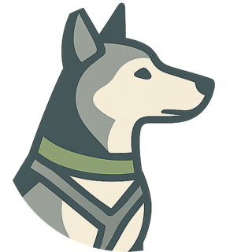

# 🐾 PfotenRegister – Die Verwaltungssoftware für Tiertafeln

**PfotenRegister** ist eine moderne, browserbasierte Verwaltungsplattform für Tiertafeln. Sie wurde speziell für ehrenamtliche Helfer:innen entwickelt, um bedürftige Tierhalter:innen effizient, sicher und benutzerfreundlich zu betreuen.

---

##  Funktionsübersicht

- **Gastverwaltung**: Registrierung, Bearbeitung, Ansichtt von Gästen inkl. rechtlicher Vertreter.
- **Gastkartensystem mit QR-Code Scanner**: Optional, nutze einen QR-Code Scanner, um Gäste einfacher zu empfangen.
- **Tierverwaltung**: Verwaltung von mehreren Tieren pro Haushalt mit Futterplänen, Gesundheitsdaten und Notizen.
- **Futterausgabe**: Einfache Dokumentation von Ausgabeterminen mit Kommentaren und Warnhinweisen bei zu früher Abholung.
- **Änderungsprotokoll**: Automatisiertes Log von Änderungen an Gast- und Tierdaten.
- **Benutzerverwaltung**: Rollenbasierte Benutzerverwaltung (Admin, Bearbeiter, Nutzer).
- **Druckbare Gästekarten**: QR-Codes und Gastnummern zur einfachen Identifikation bei der Ausgabe.
- **Anpassbar**: Anpassbare Parameter wie Logo, Farben, Name der Tiertafel, Maximalanzahl Tiere u.v.m.
- **Kassensystem für Zahlungen**: Übersichtliche Zahlungshistorien für Futter oder Zubehör.

---

##  Demo

Eine Demo zum ausprobieren der Funktionen kann unter der folgenden URL gefunden werden. 
Bitte gebe keine Personenbezogenen Daten ein. Die Datenbank wird periodisch zurückgesetzt.
Logins sind: 

| Benutzername | Passwort | Berechtigungen                                                     |
|--------------|----------|--------------------------------------------------------------------|
| admin        | admin    | Administor: Benutzerverwaltung, Gastverwaltung, Ansicht von Gästen |
| editor       | editor   | Bearbeiter: Wie Admins außer Benutzerverwaltung                    |
| user         | user     | Benutzer: Nur Ansicht von Gästen                                   |

### [PfotenRegister Demo](https://demo.pfotenregister.com)

---

## Funktionen
### Gastverwaltung


##  SetUp
PfotenRegister kann einfach selber ausgeführ oder online gehostet werden (mittels Docker). Wir empfehlen einen Service wie Google Cloud run
oder AWS Compute.
### 1. Voraussetzungen

- Python 3.8+
- MariaDB/MySQL-style Datenbank
- `pip install -r requirements.txt`
- Zugriff auf Cloud Run oder einen Webserver (z.B. über Docker)

### 2. Konfiguration

Trage deine Datenbank-Zugangsdaten in `config_run.env` ein.

### 3.1 Initialisierung / Lokale Version
Im Ordner ./PfotenRegister:
```bash
 dotenv -f config_run.env run -- python run.py
```

Rufe dann [127.0.0.1:500](127.0.0.1:500) auf, um zum LogIn zu gelangen.


### 3.2 Google Cloud Hosting
**TODO**

## FAQ

Wie viele Tiere pro Gast?  
Standardmäßig 2 – anpassbar über die Einstellungen.

Kann ich das Logo meiner Tiertafel hochladen?  
Ja! Einfach als URL in den Einstellungen eintragen oder vor Bereitstellung im static-Ordner ablegen.

Funktioniert es auch offline?  
Ja, über die Konsole. Natürlich weniger Nutzerfreundlich – Hosting über Cloud oder lokalen Server empfohlen.

Ist die Software DSGVO-konform?  
Ja, das System speichert nur notwendige personenbezogene Daten. In deiner Datenschutzvereinbarung sollte aber individuell ein Absatz zur Nutzung von Software zur Verarbeitung erstellt werden. Der Anwender ist für die DSGVO-konforme Nutzung verantwortlich.

## Lizenz / Credits / Kosten

Dieses Projekt steht unter der **CC BY-NC-SA 4.0 Lizenz**:  
Das heißt,   
	•	✅ Du darfst es anpassen & weitergeben.  
	•	❌ Keine kommerzielle Nutzung.  
	•	⚠️ Du musst die Original-Lizenz übernehmen.

Siehe: [Creative Commons Lizenztext](https://creativecommons.org/licenses/by-nc-sa/4.0/deed.de)

Dieser Code ist Urheberrechtlich geschützt. Er darf kostenfrei von eigentragenen Vereinen genutzt werden. Für andere 
der Nutzung, entfällt diese Kostenfreiheit und bedarf der schriftlichen Erlaubnis des Lizenzinhabers (admin@pfotenregister.com).
